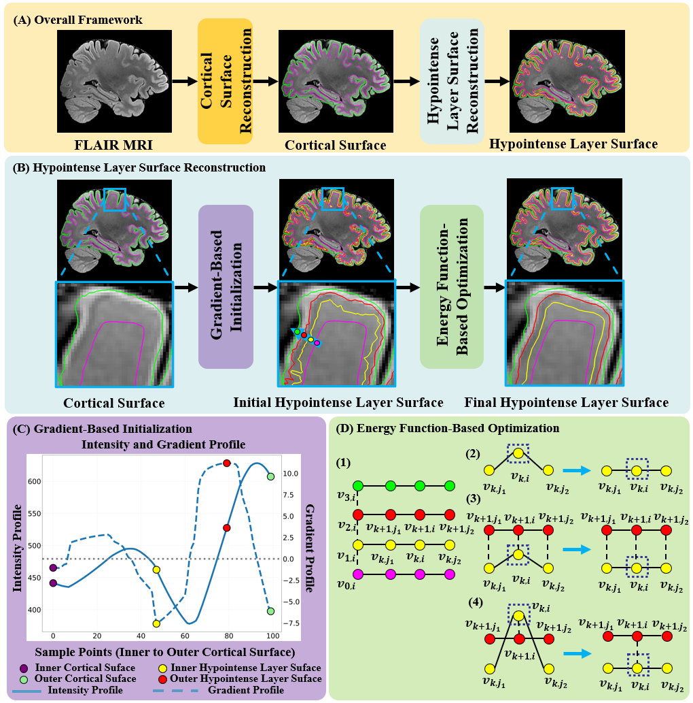

# BrainMLSR
## 1. BrainMLSR流程

<p align="center">
  
  <br>
  <em>Figure 1: pipeline of BrainMLSR.</em>
</p>

主要步骤
1. 重建出皮层内外表面
2. 通过BrainMLSR进行多信号层重建

首先，安装环境依赖
```
pip install -r requirements.txt
```
## 集成一键运行
SUBJECT_DIR 是存储原始图像T1.nii.gz和T2FLAIR.nii.gz的路径。Result_Dir是输出路径。Code_Dir是本项目的代码路径。
注意要加载符合requirements的python环境以及freesurfer

```
sbatch BrainMLSR.sh "$subject_path" "$result_dir" "#code_path"
```

### 输入的图像结构：
```
Subject/
  ├── T1.nii.gz
  └── T2FLAIR.nii.gz
```

### 最终使用的图像：
```
 Result/
  ├── mri/
      ├── T1_to_T2FLAIR_registered.mgz
      ├── T2_05.mgz
```

### 最终使用的低信号层内外表面：
```
 Result/
  ├── surf/
      ├── lh_hypo_layer.inner
      ├── lh_hypo_layer.outer
      ├── rh_hypo_layer.inner
      ├── rh_hypo_layer.outer
```

### 皮层内外表面在Freesurfer的路径下
```
 Result/
  ├── Freesurfer/
      ├──  ... (standard FreeSurfer outputs: lh.white, lh.pial, rh.white, rh.pial)
```

### 最终整体文件结构
```
BrainMLSR/
├── Subject/
│   ├── T1.nii.gz
│   └── T2FLAIR.nii.gz
│
├── Result/
│   ├── Freesurfer/
│   │   └── ... (standard FreeSurfer outputs: lh.white, lh.pial, rh.white, rh.pial)
│   │
│   ├── mri/
│   │   ├── T1_05.mgz
│   │   ├── T1_to_T2FLAIR_registered.mgz
│   │   ├── T2_05.mgz
│   │   ├── t1.nii.gz
│   │   ├── t2_flair.nii.gz
│   │   └── run_recon.py
│   │
│   └── surf/
│       ├── lh_hypo_layer.inner
│       ├── lh_hypo_layer.outer
│       ├── lh_init_hypo_layer.inner
│       ├── lh_init_hypo_layer.outer
│       ├── rh_hypo_layer.inner
│       ├── rh_hypo_layer.outer
│       ├── rh_init_hypo_layer.inner
│       ├── rh_init_hypo_layer.outer
```

## 具体处理流程
## 1. 皮层内外表面重建
为了便于广泛使用，我们以使用freesurfer为例，进行预处理并且得到皮层内外表面。当然可以通过自己的方法得到皮层内外表面，只要保证：皮层内外表面的顶点必须一一对应并且具有相同的三角形面片关系。
首先将T1和T2FLAIR序列的dicom通过dicom2niix转成nii图像。现在有的图像：T1.nii.gz，T2FLAIR.nii.gz。

### 1.1 图像预处理
为了适配Freesurfer的情况，需要将图像进行标准化到0.5X0.5X0.5mm各向同性。
```
mri_convert T1.nii.gz T1_05.mgz -cs 0.5
mri_convert T2.nii.gz T2FLAIR_05.mgz -cs 0.5
```
### 1.2 图像配准 T1配准到T2FLAIR图像
T1配准到T2FLAIR图像。为了将重建后的皮层与图像对齐，并且因为多信号层的信号在T2FLAIR图像上，我们尽量不动T2FLAIR图像，所以将T1配准到T2FLAIR。可以使用我们提供的配准代码。
```
python Step00_Register.py --fixed T2FLAIR_05.mgz --moving T1_05.nii.gz --output_dir T1_05_reg.nii.gz
```
### 1.3 皮层内外表面重建
用FreeSurfer基于T1进行皮层内外表面重建，具体freesurfer重建皮层表面可以参考freesurfer官网。其中，UII_5T替换成自己合适的路径。
```
recon-all -all -i T1_05_reg.nii.gz -s "UII_5T" -openmp 8
```

## 2.BrainMLSR进行多信号层表面重建
### 2.1 初始表面提取
通过梯度方法先得到低信号层的初始内外表面。如果是lh的话，就把所有的rh改成lh
```
python Step01_Surf_Initialization.py \
    --white  rh.white  \
    --pial rh.pial \
    --T2flair T2FLAIR_05.mgz \
    --init_hypo_inner rh_init_hypo_layer.inner \
    --init_hypo_outer rh_init_hypo_layer.outer \
```

### 2.2 多信号层表面优化
通过能量函数对曲面进行优化。如果是lh的话，就把所有的rh改成lh.
```
python Step02_Surf_optimization.py \
    --white_surf rh.white --init_hypo_inner rh_init_hypo_layer.inner --init_hypo_outer rh_init_hypo_layer.outer --pial_surf rh.pial \
    --T2_image T2FLAIR_05.mgz \
    --final_hypo_inner rh_hypo_layer.inner --final_hypo_outer rh_hypo_layer.outer
```
各参数可以直接使用默认值，也可以进行设定。
```
python Step03_Surf_optimization.py \
    --white_surf rh.white --init_hypo_inner rh_init_hypo_layer.inner --init_hypo_outer rh_init_hypo_layer.outer --pial_surf rh.pial \
    --T2_image T2FLAIR_05.mgz \
    --final_hypo_inner rh_hypo_layer.inner --final_hypo_outer rh_hypo_layer.outer \
    --alpha_inner 3.0 --alpha_outer 3.0 --beta_inner 1.0 --beta_middle 1.0 --beta_outer 1.0 --gamma_inner 0.5 --gamma_outer 0.5 \
    --learning_rate 0.01 --iterations 80 --tol 1e-6

```
